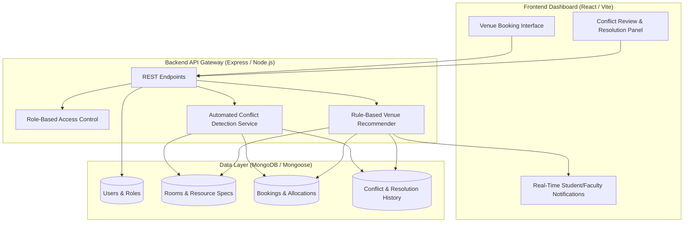

# 🏛️ Campus Resource Management: Conflict Resolution System for a University Campus
### *An Automated Venue Booking, Conflict Detection & Resolution Platform*

[](https://reactjs.org/)
[](https://expressjs.com/)
[](https://www.mongodb.com/)
[](https://www.mkdocs.org/)
[](https://www.thapar.edu/)

---

## Overview

Campus lecture halls and laboratories are often reallocated for placement activities, orientations, and other institutional events without timely notification to the affected batches and faculty. This results in last-minute class cancellations and inefficient venue reassignment due to the lack of readily available alternatives.

The **Conflict Resolution System for a University Campus** is an automated venue booking platform that aims to streamline university workflows and improve learning by reducing the time and effort required to allocate campus resources.

By coupling a **Venue Booking Portal** with an **Automated Conflict Detection Engine**, this system evaluates available rooms against specified constraints, ranks suitable venues, and gracefully resolves double bookings through rule-based recommendations.

---

## Key Features

- **Venue Booking Portal:** Timetable coordinators submit booking requests specifying required capacity, facilities (projectors, computers, etc.), time slot, and activity type (lecture, placement examination, orientation).
- **Automated Conflict Detection:** The system dynamically validates requests against existing bookings and generates alerts when resource conflicts or double bookings are detected.
- **Alternative Venue Recommendation:** For conflicting requests, the system identifies and recommends unoccupied venues that satisfy capacity, resource, and scheduling requirements.
- **Conflict Resolution Workflow:** Coordinators can review conflicting activities, view expected occupancy and responsible faculty, and select an appropriate action such as relocating or rescheduling a lower-priority activity.
- **Automated Notifications:** Affected students and faculty are notified immediately when a scheduled activity is relocated, suspended, or modified.

---

## System Architecture

The project decouples frontend interaction, backend logic, and database storage across a standard 3-tier web architecture:



---

## Evaluation Metrics & Targets

| Metric | Target Specification | Verification Scope |
| :--- | :--- | :--- |
| **Alternative Recommendation Validity** | ≥ 95% | Validates that recommendations satisfy all mandatory constraints and availability. |
| **Recommendation Proximity** | Minimum Distance | Evaluates distance between original venue and recommended alternative. |
| **Conflict Resolution Coverage** | High Coverage | Percentage of detected conflicts providing at least one feasible alternative. |
| **Notification Delivery Rate** | ~ 100% | Successful delivery rate of notification events to affected users. |

---

## Repository Structure

```text
ucs503p-202627-Campus_Resource_Management/
├── assets/                                 # Static themes, logos, and styling
├── code/                                   # Full-Stack Application Codebase
│   ├── backend/                            # Node.js Express Backend
│   │   ├── models/                         # Mongoose schemas (Activity, Room, User)
│   │   ├── routes/                         # API endpoint handlers
│   │   ├── index.js                        # Main Express server entrypoint
│   │   └── package.json                    # Backend dependencies
│   └── frontend/                           # React + Vite Web App
│       ├── src/                            # React components & UI logic
│       ├── public/                         # Static assets
│       ├── index.html                      # Main HTML template
│       └── package.json                    # Frontend dependencies
├── docs/                                   # MkDocs documentation site source
│   ├── Project_Presentation.pdf            # Slide Presentation Deck
│   ├── UseCaseDiagram.pdf                  # UML Use Case Diagram
│   └── index.md                            # Documentation homepage
├── journals/                               # Team weekly engineering work logs
├── project-proposal/                       # LaTeX Academic Proposal
│   ├── main.pdf                            # Compiled Academic Proposal (PDF)
│   └── main.tex                            # Formal LaTeX Proposal Source
├── Makefile                                # Build automation for docs
├── mkdocs.yml                              # MkDocs configuration
└── README.md                               # Project master documentation
```

---

## Getting Started

### 1. Prerequisites
- **Node.js**: `v18.0.0` or higher
- **npm**: `v9.0.0` or higher
- **Python**: `3.10+` (optional, for compiling MkDocs documentation locally)
- **MongoDB**: Local instance or MongoDB Atlas cluster

---

### 2. Running the Full-Stack Prototype Locally

**Terminal 1: Start Backend API**
```bash
cd code/backend
npm install
npm run dev
```

**Terminal 2: Start Frontend Application**
```bash
cd code/frontend
npm install
npm run dev
```

Once both servers are running, the application will be accessible via your browser.

---

### 3. Serving the Academic Documentation Site (MkDocs)

```bash
# Build and serve the documentation locally
make docs
```
Documentation will be accessible at: `http://127.0.0.1:8000/`

---

## 👥 Authors & Team Information

This project is developed as part of **UCS503P: Software Engineering Project** at **Thapar Institute of Engineering and Technology (TIET), Patiala** under the supervision of **Dr. Jeelani Asif**.

| Name | Roll Number | Email | Department |
| :--- | :--- | :--- | :--- |
| **Arhana Mor** | `1024030773` | [`amor_be24@thapar.edu`](mailto:amor_be24@thapar.edu) | Computer Science & Engineering |
| **Garv Bansal** | `1024030988` | [`gbansal_be24@thapar.edu`](mailto:gbansal_be24@thapar.edu) | Computer Science & Engineering |

---

<p align="center">
  <b>Campus Resource Management</b> • Automated Venue Booking & Conflict Resolution • Academic Year 2026-27
</p>
