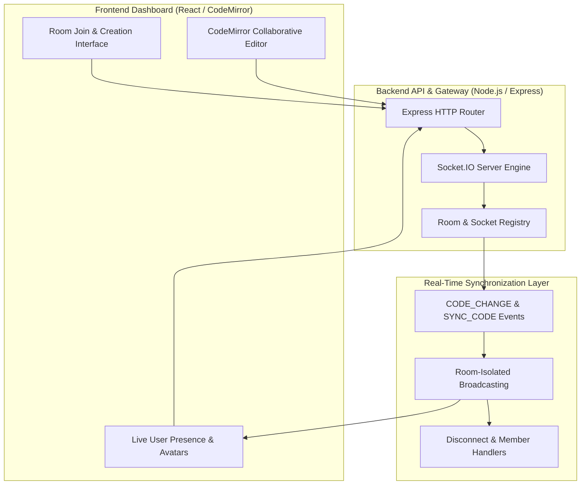

# 💻 CodeRoom: Real-Time Collaborative Code Editor
### *A Web-Based Dynamic Code Synchronization & Multi-User Peer Programming Platform*

[](https://reactjs.org/)
[](https://expressjs.com/)
[](https://socket.io/)
[](https://www.mkdocs.org/)
[](https://www.thapar.edu/)

---

## Overview

Collaborative programming is essential for modern software engineering education and developer pair programming. However, traditional workflows often rely on repeatedly sharing source files, pasting code fragments into messaging platforms, or dealing with tedious manual merge conflicts.

**CodeRoom** is a web-based, real-time collaborative code editor platform that eliminates friction in remote peer coding. By coupling an interactive **CodeMirror Workspace** with a low-latency **Socket.IO Event Engine**, CodeRoom allows multiple users to join a shared coding room via a unique Room ID, see live code changes as they happen, and monitor active room participants through dynamic user avatars.

---

## Key Features

- **Room-Based Collaboration:** Users can dynamically create a new coding session with a unique UUID or join an existing session via a Room ID.
- **Real-Time Code Synchronization:** Code edits made by any participant are captured instantly by CodeMirror and broadcast across all connected clients via Socket.IO.
- **Presence & Avatar Tracking:** Active room members are displayed in real-time on the sidebar using dynamic user avatars (`react-avatar`).
- **Late-Join State Synchronization:** When a new user joins an ongoing coding session, the server syncs the latest editor state to ensure zero code discrepancy.
- **User Experience & Feedback:** Includes one-click room ID clipboard copying, toast notification alerts (`react-hot-toast`), and clean room exit actions.

---

## System Architecture

The project decouples frontend interaction, real-time WebSocket communication, and room management across a 3-tier system architecture:



---

## Evaluation Metrics & Targets

| Metric | Target Specification | Verification Scope |
| :--- | :--- | :--- |
| **Synchronization Latency** | < 100 ms | Validates low-latency delivery of keystroke edits between connected clients. |
| **Code State Consistency** | 100% | Guarantees that newly joining clients receive the full current state of the code. |
| **Room Isolation Enforcement** | 100% | Confirms that broadcast events are strictly restricted to members of the specific Room ID. |
| **Disconnect Broadcast Rate** | ~ 100% | Ensures immediate cleanup and active user avatar list updates upon client disconnection. |

---

## Repository Structure

```text
CodeRoom/
├── .github/                                # CI/CD workflows & automated build checks
├── assets/                                 # Architecture diagrams and system flow graphs
├── code/                                   # Full-Stack Application Codebase
│   ├── backend/                            # Node.js + Express + Socket.IO Backend
│   │   ├── Actions.js                      # Socket event action definitions
│   │   ├── server.js                       # Main Express & Socket.IO server entrypoint
│   │   └── package.json                    # Backend dependencies
│   └── frontend/                           # React Web App with CodeMirror
│       ├── src/                            # React components, pages & socket logic
│       ├── public/                         # Static assets & HTML template
│       └── package.json                    # Frontend dependencies
├── docs/                                   # MkDocs documentation site source
│   ├── architecture.md                     # System architecture documentation
│   ├── index.md                            # Documentation homepage
│   ├── journals.md                         # Log overview
│   └── proposal.md                         # Proposal overview
├── journals/                               # Team weekly engineering work logs
│   ├── harwinder.md                        # Weekly progress log for Harwinder
│   └── yuvraj.md                           # Weekly progress log for Yuvraj Jasuja
├── project-proposal/                       # LaTeX Academic Proposal
│   ├── Main.tex                            # Formal LaTeX Proposal Source
│   └── proposal_pdf.pdf                    # Compiled Academic Proposal (PDF)
├── project-report-final/                   # Final milestone report documentation
├── project-report-prototype-stage/         # Prototype stage evaluation report
├── .gitignore                              # Git ignore rules
├── LICENSE                                 # Project software license (MIT)
├── Makefile                                # Build automation & script shortcuts
├── mkdocs.yml                              # MkDocs site configuration
├── pyproject.toml                          # Python environment & tooling configuration
└── README.md                               # Project master documentation
```

---

## Getting Started

### 1. Prerequisites
- **Node.js**: `v16.0.0` or higher
- **npm**: `v8.0.0` or higher
- **Python**: `3.9+` (optional, for serving local MkDocs documentation)

---

### 2. Running the Full-Stack Application Locally

**Terminal 1: Start Backend API & Socket Server**
```bash
cd code/backend
npm install
npm run dev
```

**Terminal 2: Start Frontend Web Application**
```bash
cd code/frontend
npm install
npm start
```

Once both servers are running, the application will be accessible via your browser at `http://localhost:3000`.

---

### 3. Serving Academic Documentation (MkDocs)

```bash
# Serve documentation locally using Makefile shortcut
make docs
```
Or run directly using Python:
```bash
mkdocs serve
```
Documentation site will be accessible at `http://127.0.0.1:8000/`.

---

## 👥 Authors & Team Information

This project is developed as part of **UCS503P: Software Engineering Project** at **Thapar Institute of Engineering and Technology (TIET), Patiala** under the supervision of **Dr. Jeelani Asif**.

| Name | Roll Number | Email | Department | Role |
| :--- | :--- | :--- | :--- | :--- |
| **Yuvraj Jasuja** | `1024030069` | [`yjasuja_be24@thapar.edu`](mailto:yjasuja_be24@thapar.edu) | Computer Engineering | Team Lead, Full-Stack Architect & Git Coordinator |
| **Harwinder** | `1024030075` | [`harwinder_be24@thapar.edu`](mailto:harwinder_be24@thapar.edu) | Computer Engineering | Frontend Developer & UI/UX Specialist |

---

<p align="center">
  <b>CodeRoom</b> • Real-Time Collaborative Code Editor • Academic Year 2026-27
</p>
