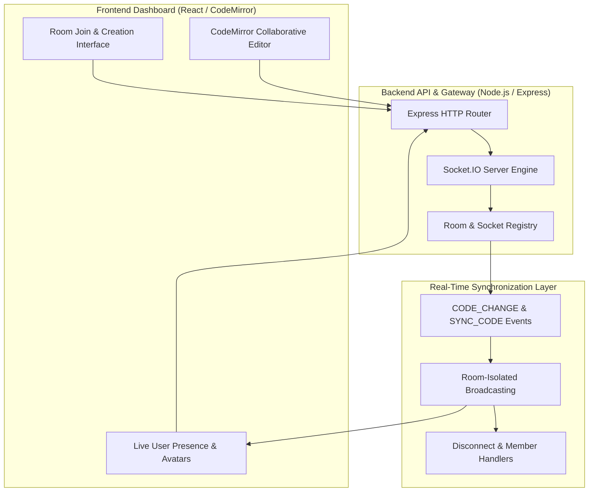

# 🏛️ System Architecture

CodeRoom is built on a 3-tier modular architecture decoupling client UI interactions, WebSocket event gateway routing, and state synchronization.

---

## High-Level Architecture Overview

---

## Dataflow & Real-Time Event Engine

The core synchronization flow between clients is powered by standard Socket.IO event protocols:

1. **`JOIN` Event**: Triggered when a user enters a room with a username and Room ID.
2. **`JOINED` Broadcast**: Emitted to all clients in the room to update the active avatar list.
3. **`CODE_CHANGE` Event**: Emitted on every keystroke in CodeMirror to broadcast code state updates.
4. **`SYNC_CODE` Event**: Ensures late-joining clients receive the latest code state from active room members.
5. **`DISCONNECTED` Broadcast**: Triggered when a socket connection drops to update active user counts.

---

## Architectural Diagrams

- **Dataflow Diagrams**: `docs/Dataflow Diagrams.png`
- **Sync Flow Diagram**: `docs/Sync Flow.png`
- **System Architecture**: `docs/System Architecture.png`
- **ER Diagram**: `docs/er diagram.png`
