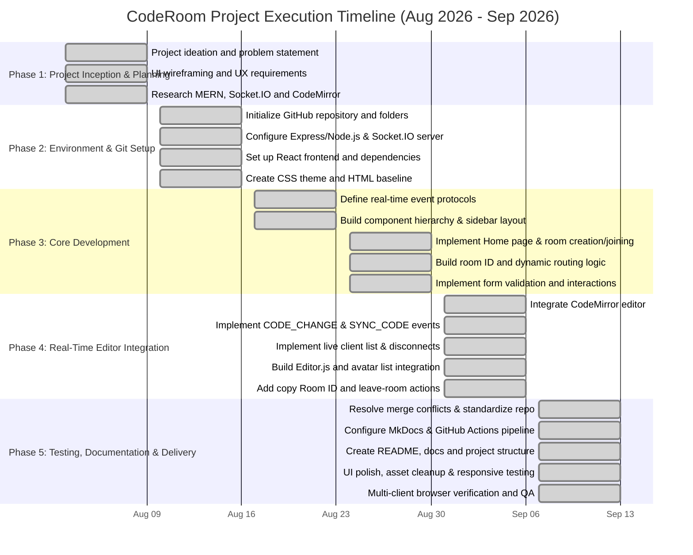

# 📅 Project Timeline & Gantt Chart

## Project Overview

- **Project Name:** CodeRoom - Real-Time Collaborative Code Editor
- **Team Members:** Yuvraj Jasuja & Harwinder Singh
- **Project Start Date:** August 3, 2026 (`2026-08-03`)
- **Completion Date:** September 13, 2026 (`2026-09-13`)
- **Current Status:** 100% Completed

---

## Visual Gantt Chart

---

## Detailed Task & Progress Breakdown

### Phase 1: Project Inception & Planning (Aug 3, 2026 – Aug 9, 2026)

| Task | Assigned To | Progress | Start Date | End Date | Status |
| :--- | :--- | :---: | :---: | :---: | :---: |
| Project ideation and problem statement | Yuvraj Jasuja | 100% | 08/03/2026 | 08/09/2026 | Completed |
| UI wireframing and UX requirements | Harwinder Singh | 100% | 08/03/2026 | 08/09/2026 | Completed |
| Research MERN, Socket.IO and CodeMirror | Yuvraj Jasuja | 100% | 08/03/2026 | 08/09/2026 | Completed |

---

### Phase 2: Environment & Git Setup (Aug 10, 2026 – Aug 16, 2026)

| Task | Assigned To | Progress | Start Date | End Date | Status |
| :--- | :--- | :---: | :---: | :---: | :---: |
| Initialize GitHub repository and folders | Yuvraj Jasuja | 100% | 08/10/2026 | 08/16/2026 | Completed |
| Configure Express/Node.js and Socket.IO server | Yuvraj Jasuja | 100% | 08/10/2026 | 08/16/2026 | Completed |
| Set up React frontend and dependencies | Harwinder Singh | 100% | 08/10/2026 | 08/16/2026 | Completed |
| Create CSS theme and HTML baseline | Harwinder Singh | 100% | 08/10/2026 | 08/16/2026 | Completed |

---

### Phase 3: Core Development (Aug 17, 2026 – Aug 30, 2026)

| Task | Assigned To | Progress | Start Date | End Date | Status |
| :--- | :--- | :---: | :---: | :---: | :---: |
| Define real-time event protocols | Yuvraj Jasuja | 100% | 08/17/2026 | 08/23/2026 | Completed |
| Build component hierarchy and sidebar layout | Harwinder Singh | 100% | 08/17/2026 | 08/23/2026 | Completed |
| Implement Home page and room creation/joining | Yuvraj Jasuja | 100% | 08/24/2026 | 08/30/2026 | Completed |
| Build room ID and dynamic routing logic | Yuvraj Jasuja | 100% | 08/24/2026 | 08/30/2026 | Completed |
| Implement form validation and interactions | Harwinder Singh | 100% | 08/24/2026 | 08/30/2026 | Completed |

---

### Phase 4: Real-Time Editor Integration (Aug 31, 2026 – Sep 6, 2026)

| Task | Assigned To | Progress | Start Date | End Date | Status |
| :--- | :--- | :---: | :---: | :---: | :---: |
| Integrate CodeMirror editor | Yuvraj Jasuja | 100% | 08/31/2026 | 09/06/2026 | Completed |
| Implement CODE_CHANGE and SYNC_CODE events | Yuvraj Jasuja | 100% | 08/31/2026 | 09/06/2026 | Completed |
| Implement live client list and disconnect broadcasts | Yuvraj Jasuja | 100% | 08/31/2026 | 09/06/2026 | Completed |
| Build Editor.js and avatar list integration | Harwinder Singh | 100% | 08/31/2026 | 09/06/2026 | Completed |
| Add copy Room ID and leave-room actions | Harwinder Singh | 100% | 08/31/2026 | 09/06/2026 | Completed |

---

### Phase 5: Testing, Documentation & Delivery (Sep 7, 2026 – Sep 13, 2026)

| Task | Assigned To | Progress | Start Date | End Date | Status |
| :--- | :--- | :---: | :---: | :---: | :---: |
| Resolve merge conflicts and standardize repository | Yuvraj Jasuja | 100% | 09/07/2026 | 09/13/2026 | Completed |
| Configure MkDocs and GitHub Actions pipeline | Yuvraj Jasuja | 100% | 09/07/2026 | 09/13/2026 | Completed |
| Create README, docs and project structure | Yuvraj Jasuja | 100% | 09/07/2026 | 09/13/2026 | Completed |
| UI polish, asset cleanup and responsive testing | Harwinder Singh | 100% | 09/07/2026 | 09/13/2026 | Completed |
| Multi-client browser verification and QA | Harwinder Singh | 100% | 09/07/2026 | 09/13/2026 | Completed |
